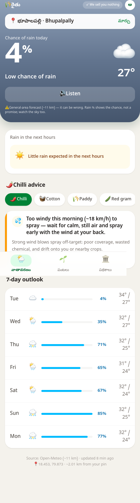
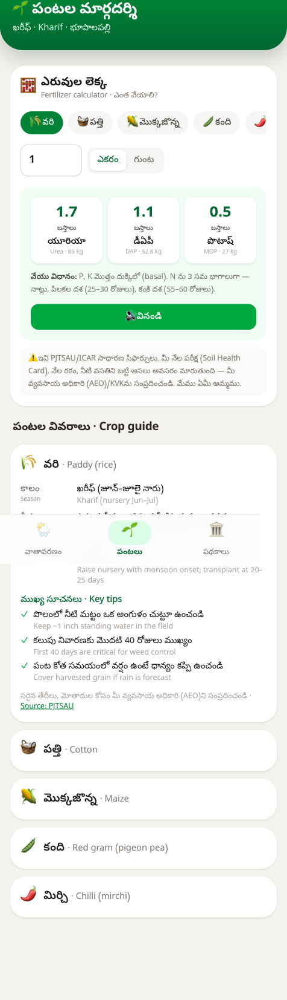
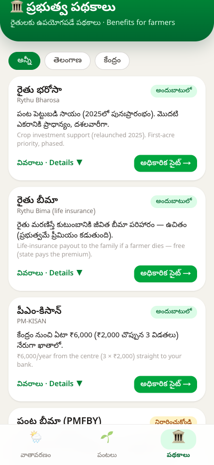
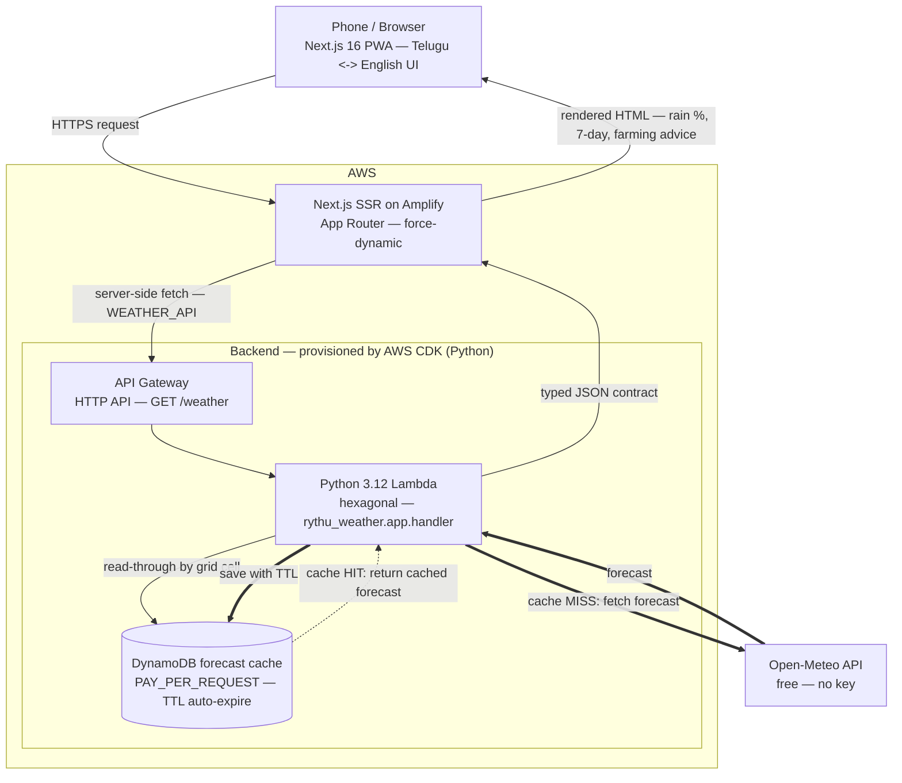

# Rythu (రైతు)

**A Telugu-first, honest weather + crop-advisory web app for small farmers in Bhupalpally, Telangana.** Full-stack and **live in production** — a Next.js / TypeScript front end backed by a hexagonal Python service on AWS serverless (Lambda + API Gateway + DynamoDB), provisioned with AWS CDK.

[](https://main.d3jtg3gae71asa.amplifyapp.com)
&nbsp;
[](https://github.com/Ashishkosana/rythu/actions/workflows/ci.yml)

[](https://nextjs.org/)
[](https://react.dev/)
[](https://www.typescriptlang.org/)
[](https://www.python.org/)
[](https://aws.amazon.com/)
[](https://mypy-lang.org/)
[](#tests--quality-gate)
[](#tests--quality-gate)

> **Live app:** https://main.d3jtg3gae71asa.amplifyapp.com — the weather home, crops guide, and government-schemes screen are all serving in production. It is a server-rendered web app and an installable PWA (add to home screen); it is **not** a native mobile app.

---

## Screenshots

| Weather + 7-day forecast | Fertilizer calculator (Crops) | Government schemes |
| --- | --- | --- |
|  |  |  |

*(The app defaults to Telugu with a Telugu ⇄ English toggle — the weather screen above is in English content mode; the crops and schemes screens show the Telugu-first UI.)*

---

## Stack

| Layer | What it is |
| --- | --- |
| **Frontend** | Next.js 16 (App Router, SSR, `force-dynamic`), React 19, TypeScript 5, Tailwind CSS v4, Vitest for unit tests. Deployed on **AWS Amplify** (SSR hosting). |
| **Backend** | Python 3.12 `rythu-weather` service in **hexagonal / ports-and-adapters** layout (`domain` / `adapters` / `app`). Single runtime dependency: `httpx`. Weather data from [Open-Meteo](https://open-meteo.com) (free, no API key). Packaged with `uv` + `hatchling`. |
| **Infra** | **AWS CDK** (Python): API Gateway v2 **HTTP API → Lambda** (`rythu_weather.app.handler`, 256 MB, 15 s, reserved concurrency 10) **→ DynamoDB** forecast cache (`PAY_PER_REQUEST`, TTL auto-expire). |
| **Quality gate** | Backend: `ruff` + `mypy --strict` + `pytest`. Frontend: `vitest`. |

The front end reaches the backend through a `WEATHER_API` value inlined at build time in `next.config.ts` (a workaround for Amplify not exposing env vars to the SSR runtime), with a `http://127.0.0.1:8001` fallback for local dev.

---

## Architecture



*Serverless request flow: a server-rendered Next.js PWA calls a hexagonal Python Lambda via API Gateway, fronted by a TTL DynamoDB read-through cache (dotted = cache hit, bold = cache miss to Open-Meteo); the API Gateway → Lambda → DynamoDB backend is provisioned by AWS CDK.*

**Request flow (weather):** the App Router page renders server-side on Amplify, does a server-side fetch to the API Gateway HTTP API, which invokes the Lambda handler. The service checks the DynamoDB read-through cache (keyed by weather grid cell, TTL); on a miss it calls Open-Meteo via the `httpx` adapter. The **domain engine + rules** build a typed `farming_read[]` plus reliability/coords, everything is serialized into one typed JSON contract, and `WeatherScreen.tsx` renders rain %, hourly bars, the 7-day outlook, and the advice cards.

**Separate paths:** village search is a client → Next.js `/api/geocode` route (Node runtime) → Nominatim primary, Open-Meteo geocoding fallback, day-cached. The **crops guide, fertilizer calculator, and schemes** screens are 100% static client-side data (`lib/crops.ts`, `lib/agronomy.ts`, `lib/schemes.ts`) and do **not** call the Python backend.

### Why it's built this way (the decisions I can defend)

- **Hexagonal backend with a domain-purity test.** The Open-Meteo client, the DynamoDB cache, and a fake adapter are all swappable ports; a `test_domain_purity` guard keeps the rules/engine/models free of I/O, so the advice engine is unit-testable without any HTTP. The wire shape is defined in exactly one place (`app/serialize.py`).
- **The DynamoDB read-through cache is a cost / rate-limit decision.** `PAY_PER_REQUEST` + TTL caps Open-Meteo calls to roughly one per grid cell per window, and Lambda `reserved_concurrent_executions = 10` caps a public endpoint — both keep a free-for-farmers app inside free-tier economics.
- **One typed JSON contract** between Python and TypeScript, and it deliberately never leaks raw upstream fields or emits a "confidence" score (see the sample below).
- **Build-time inlining of `WEATHER_API`** works around Amplify not exposing env vars to the SSR runtime, while a localhost fallback keeps local dev friction-free.
- **Deploy packaging:** `build_lambda.sh` bundles `httpx` into `infra/build/lambda`; the CDK stack falls back to pure source so `cdk synth` still works without the bundled deps.

<details>
<summary><b>Typed response contract (trimmed sample)</b></summary>

```jsonc
{
  "source": "Open-Meteo",
  "resolution_km": 11,
  "coords": {
    "requested": { "lat": 18.44, "lon": 79.85 },
    "returned":  { "lat": 18.45, "lon": 79.80 },
    "snap_distance_km": 4.9
  },
  "generated_at": "2026-07-14T09:00:00+05:30",
  "upstream_fetched_at": "2026-07-14T08:55:00+05:30",
  "reliability": {
    "resolution_km": 11,
    "disclaimer_en": "…grid-cell forecast, can be wrong, watch the sky…",
    "source_stamp_en": "Open-Meteo · ~11 km · updated 5 min ago",
    "is_offline_cache": false
  },
  "farmer_context": { "crop": "chilli", "water_source": "rainfed" },
  "farming_read": [
    {
      "id": "spray-hold",
      "action": "spray",
      "crop": "chilli",
      "severity": "caution",
      "triggered": true,
      "headline_en": "Rain likely in the next 12h — hold spraying",
      "detail_en": "…",
      "caveat_en": "Probability, not certainty; check the sky before you decide.",
      "window_note": "Better window: tomorrow morning",
      "sources": ["PJTSAU"]
    }
  ],
  "hourly_rain": [ { "time_local": "…", "precipitation_probability": 62, "emoji": "🌧️" } ],
  "daily": [ { "date": "…", "precipitation_probability_max": 70, "temperature_max_c": 33, "emoji": "⛅" } ]
}
```
Note: `rule_confidence` exists internally but is **intentionally not serialised** — a probability is shown to farmers, never a fake confidence rating.
</details>

---

## Tests & quality gate

CI (GitHub Actions) runs `ruff` + `mypy --strict` + `pytest` for the backend and `vitest` for the frontend on every push and PR — see the CI badge at the top. You can also reproduce the numbers locally with the commands below.

- **Backend — 94 tests pass** (1 network "live" test deselected by default); 95 test functions across 12 files in `services/weather/tests` (rules 27, chilli 13, engine 10, open-meteo/serialize/windows ~7–8 each, cache/handler 6, reliability/wmo 4, service 2, domain-purity 1). Gate is `ruff` + `mypy --strict` + `pytest`.
  ```bash
  cd services/weather && uv run ruff check . && uv run mypy && uv run pytest   # -> 94 passed, 1 deselected
  ```
- **Frontend — 40 tests pass** across 6 Vitest files, all in `apps/web/lib` (agronomy 8, geocode 11, schemes 7, speak 7, crops 4, sky 3).
  ```bash
  cd apps/web && npm run test   # vitest run -> Test Files 6 passed, Tests 40 passed
  ```
  These are **pure lib/unit tests only** — there are intentionally no React render/component tests and no end-to-end tests in the repo.

---

## What's shipped (live in production)

- **Honest weather screen** — big rain-chance %, a 12-hour hourly rain-probability bar chart, a 7-day outlook, temperature, a weather-code sky emoji, and a dynamic sky-gradient hero. Every forecast carries a source + resolution + last-updated stamp and the grid-cell snap distance.
- **Farming-reads engine** — spray / irrigate / sow / harvest / drainage / scout advice, each tagged with severity (`info` / `caution` / `act`), a collapsible "Why?" caveat, a window note, and a cited agronomy source; chilli gets its own season-aware rules.
- **Government schemes screen (`/schemes`)** — 19 hand-verified state + central schemes with status badges (active / verify / at-risk / closed / suspended), a central/state filter, priority sort, per-scheme honesty notes, and official-site links.
- **Crops guide (`/crops`)** — per-crop season / water / sowing / tips, cited to PJTSAU, with an "AEO-confirm" disclaimer.
- **Fertilizer calculator** — pick a crop + area (acre / guntha) → Urea / DAP / MOP bags & kg computed deterministically and offline from cited PJTSAU / ICAR N:P:K doses, with N-overdose-safe framing, a Telugu "Listen" text-to-speech, and an always-on soil-test / AEO fallback.
- **5 crops wired end-to-end** (backend `Crop` enum ↔ frontend): chilli/mirchi, cotton, paddy, red gram, maize.
- **Location picker** — browser GPS, verified pilot mandals, and per-village search via the server-side `/api/geocode` route (Nominatim primary, Open-Meteo geocoding fallback, day-cached). Location persists across crop switches; the default is the district HQ.
- **Farmer-first UX** — Telugu-first (default Telugu, Telugu ⇄ English toggle), tap-to-hear Telugu voice, a first-run Welcome overlay, remembered village + language, big tap targets, PWA install, and a safe-area-aware iOS-style bottom tab nav (Weather / Crops / Schemes).
- **Offline / degraded handling** — the DynamoDB read-through cache, an offline-cache badge, a degraded-state message, and the honest source stamp.

**One honest limitation:** the farming-advice text is **English-only for now** — the app openly says *"Advice is in English for now (Telugu coming)."* The Telugu-first UI (labels, voice) is live; the advice copy is the next localization step.

---

## Ethos & guardrails (please keep these)

This is a tool for farmers, so honesty is encoded in the code and enforced as guardrails:

- **Truthful weather** — always a *probability*, never a "confidence"; source + resolution + last-updated shown; a fixed grid-snap disclaimer. The word "hyperlocal" and any "Apple-grade" claim are explicitly banned — it is a disclosed Open-Meteo grid-cell forecast.
- **Farmer-safe advice** — conservative, cited to neutral official bodies (PJTSAU / ICAR / TNAU cross-check), never company or brand formulas. Some crop doses carry a `needsVerification` flag and unvetted agronomy thresholds carry `TODO-VET` markers that need district-agri-office sign-off before shipping. The fertilizer / crop numbers are **cited general norms, not field-verified precision**, and a soil-test / AEO fallback is always shown.
- **Nothing is hidden or sold** — schemes show a status badge instead of being silently dropped, and there is no input-sales funnel. Free for farmers, forever.

---

## Run it locally (two terminals)

**1. Backend** (Python 3.12, needs [uv](https://docs.astral.sh/uv/)):

```bash
cd services/weather
uv sync --extra dev
uv run python -m rythu_weather.app.local_server 8001      # http://127.0.0.1:8001/weather
```

**2. Frontend** (Node 20+):

```bash
cd apps/web
npm install
npm run dev                                                # http://localhost:3000
```

Open `http://localhost:3000`. In local dev the front end falls back to `http://127.0.0.1:8001`, so both terminals together give you the full weather flow. To use it from a **phone on the same Wi-Fi**, run `npx next dev -H 0.0.0.0` and open `http://<your-computer-ip>:3000`.

---

## Repo layout

```
apps/web          Next.js 16 + TypeScript + Tailwind — the SSR web app / PWA
services/weather  Python, hexagonal — Open-Meteo -> farming-read engine -> typed JSON (runs on Lambda)
infra             AWS CDK (Python) — API Gateway HTTP API + Lambda + DynamoDB cache
docs              problem statement, farmer research, agronomy / chilli / schemes specs,
                  the verified weather spec, and screenshots
prototype         early HTML prototype
```

---

## Data & credits

Weather: [Open-Meteo](https://open-meteo.com) (free, no key). Geocoding: [OpenStreetMap Nominatim](https://nominatim.org/) with an Open-Meteo geocoding fallback. Agronomy, crop, and fertilizer norms: **PJTSAU / ICAR / TNAU** (cited in `docs/`). Scheme facts link to their official government sources. Built for the Bhupalpally, Telangana pilot.
